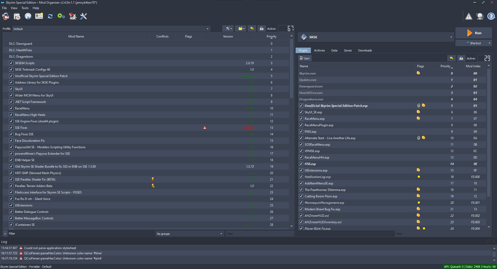

# Nord ModOrganizer 2 Theme

I loved the [Nord theme](https://www.nordtheme.com/) and used it for my desktop on all my operating systems and I really love playing Skyrim so I figured why not make a matching theme for ModOrganizer 2. This is still very much a WIP build, but it is coming along.

**Update March 15, 2022:** I am planning on redesigning this theme from scratch using some of the new things I have learned since making this one and playing around with new ideas. I will releasea preview of it soon.

**Uses resources from VS15-Dark from chintsu_kun as a base for the limited graphics used. Thank you.**

**_If you have any suggestions or ideas, please submit them as an issue. Thank you!_**

Find the [releases here](https://github.com/jennykitten78/nord-mo2-theme/releases).
